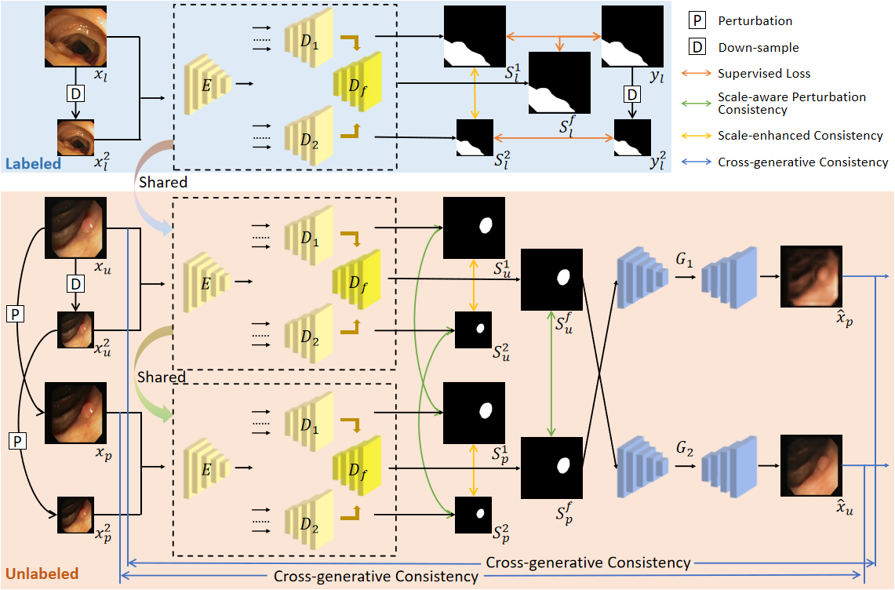
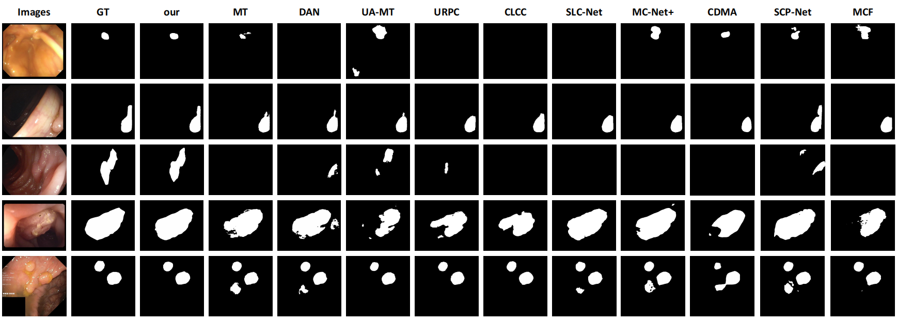

# Dual-scale enhanced and cross-generative consistency learning for semi-supervised medical image segmentation

> **Authors:** 
> [Yunqi Gu](),
> [Tao Zhou](https://taozh2017.github.io/),
> [Yizhe Zhang](),
> [Yi Zhou](https://cse.seu.edu.cn/2021/0303/c23024a362239/page.htm), 
> [Kelei He](https://scholar.google.com/citations?user=0Do_BMIAAAAJ&hl=en), 
> [Chen Gong](https://gcatnjust.github.io/ChenGong/index.html), and
> [Huazhu Fu](http://hzfu.github.io/).


## 1. Preface

- This repository provides code for "_**Dual-scale enhanced and cross-generative consistency learning for semi-supervised medical image segmentation (DEC-Seg)**_". 
([paper](https://www.sciencedirect.com/science/article/pii/S0031320324007131))

- If you have any questions about our paper, feel free to contact me. And if you are using DEC-Seg for your research, please cite this paper ([BibTeX](#4-citation)).


### 1.1. :fire: NEWS :fire:

- [2023/05/20] Release training/testing code.

- [2020/05/10] Create repository.


### 2.1. Table of Contents

- [Dual-scale enhanced and cross-generative consistency learning for semi-supervised medical image segmentation]
  - [2. Overview](#2-overview)
    - [2.1. Introduction](#21-introduction)
    - [2.2. Framework Overview](#22-framework-overview)
    - [2.3. Qualitative Results](#23-qualitative-results)
  - [3. Proposed Baseline](#3-proposed-baseline)
    - [3.1. Training/Testing](#31-trainingtesting)
    - [3.2 Evaluating your trained model:](#32-evaluating-your-trained-model)
    - [3.3 Pre-computed maps:](#33-pre-computed-maps)
  - [4. Citation](#4-citation)
  - [5. License](#5-license)

<small><i><a href='http://ecotrust-canada.github.io/markdown-toc/'>Table of contents generated with markdown-toc</a></i></small>

## 2. Overview

### 2.1. Introduction

Medical image segmentation plays a crucial role in computer-aided diagnosis. However, existing methods heavily rely on fully supervised training, which requires a large amount of labeled data with time-consuming pixel-wise annotations. Moreover, accurately segmenting lesions poses challenges due to variations in shape, size, and location. To address these issues, we propose a novel Dual-scale Enhanced and Cross-generative consistency learning framework for semi-supervised medical image Segmentation (DEC-Seg). First, we propose a Cross-level Feature Aggregation (CFA) module that integrates features from adjacent layers to enhance the feature representation ability across different resolutions. To address scale variation, we present a scale-enhanced consistency constraint, which ensures consistency in the segmentation maps generated from the same input image at different scales. This constraint helps handle variations in lesion sizes and improves the robustness of the model. Furthermore, we propose a cross-generative consistency scheme, in which the original and perturbed images can be reconstructed using cross-segmentation maps. This consistency constraint allows us to mine effective feature representations and boost the segmentation performance. To further exploit the scale information, we propose a Dual-scale Complementary Fusion (DCF) module that integrates features from two scale-specific decoders operating at different scales to help produce more accurate segmentation maps. Extensive experimental results on multiple medical segmentation tasks (polyp, skin lesion, and brain glioma) demonstrate the effectiveness of our DEC-Seg against other state-of-the-art semi-supervised segmentation approaches.

### 2.2. Framework Overview

<p align="center">
     <br />
    <em> 
    Figure 1: Overview of the proposed DEC-Seg.
    </em>
</p>

### 2.3. Qualitative Results

<p align="center">
     <br />
    <em> 
    Figure 2: Qualitative Results.
    </em>
</p>

## 3. Proposed Baseline

### 3.1. Training/Testing

The training and testing experiments are conducted using [PyTorch](https://github.com/pytorch/pytorch) with 
a single NVIDIA GeForce RTX3090 GPU with 24 GB Memory.

> Note that our model also supports low memory GPU, which means you can lower the batch size


1. Configuring your environment (Prerequisites):
   
    Note that DEC-Seg is only tested on Ubuntu OS with the following environments. 
    It may work on other operating systems as well but we do not guarantee that it will.
    
    + Creating a virtual environment in terminal: `conda create -n DEC-Seg python=3.8`.
    
    + Installing necessary packages: PyTorch 1.9.0

2. Downloading necessary data:

    + preprocess the training and test data and place it into `./data/` with the following structure:
      ```
      |-- data
      |   |-- PolypDataset
      |       |-- train
      |       |-- val
      |       |-- test
      |           |-- CVC-300
      |           |-- CVC-ClinicDB
      |           |-- CVC-ColonDB
      |           |-- ETIS-LaribPolypDB
      |           |-- Kvasir
      |       |-- train.txt
      |       |-- val.txt
      |       |-- CVC-300.txt
      |       |-- CVC-ClinicDB.txt
      |       |-- CVC-ColonDB.txt
      |       |-- ETIS-LaribPolypDB.txt
      |       |-- Kvasir.txt
      ```

    + downloading Res2Net weights and and move it into `./checkpoints/`, 
    which can be found in this [download link (Google Drive)](https://drive.google.com/file/d/1_1N-cx1UpRQo7Ybsjno1PAg4KE1T9e5J/view?usp=sharing).
   
4. Training Configuration:

    + Assigning your costumed path, like `--root_path` and `--train_save` in `train.py`.
    
    + Just enjoy it!

5. Testing Configuration:

    + After you download all the pre-trained model and testing dataset, just run `MyTest.py` to generate the final prediction map: 
    replace your trained model directory (`--pth_path`).
    
    + Just enjoy it!

### 3.2 Evaluating your trained model:

Matlab: One-key evaluation is written in MATLAB code ([link](https://drive.google.com/file/d/1_h4_CjD5GKEf7B1MRuzye97H0MXf2GE9/view?usp=sharing)), 
please follow this the instructions in `./eval/main.m` and just run it to generate the evaluation results in `./res/`.
The complete evaluation toolbox (including data, map, eval code, and res): [new link](https://drive.google.com/file/d/1bnlz7nfJ9hhYsMLFSBr9smcI7k7p0pVy/view?usp=sharing). 

### 3.3 Pre-computed maps: 
They can be found in [download link]().

## 4. Citation

Please cite our paper if you find the work useful: 
    
    @article{gu2025dual,
      title={Dual-scale enhanced and cross-generative consistency learning for semi-supervised medical image segmentation},
      author={Gu, Yunqi and Zhou, Tao and Zhang, Yizhe and Zhou, Yi and He, Kelei and Gong, Chen and Fu, Huazhu},
      journal={Pattern Recognition},
      volume={158},
      pages={110962},
      year={2025},
      publisher={Elsevier}
    }


## 5. License

The source code is free for research and education use only. Any comercial use should get formal permission first.

---

**[⬆ back to top](#0-preface)**
